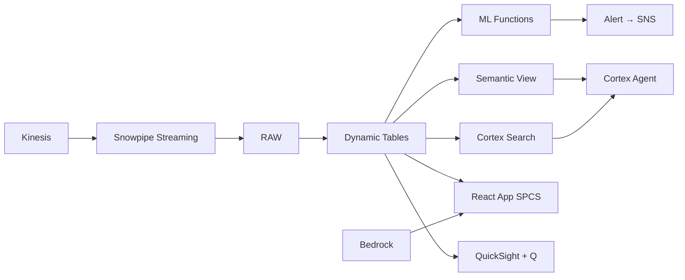

# Energy Trading & Risk Management

Real-time energy trading analytics for Malaysia's LNG and crude markets — Snowpipe Streaming ingests price feeds, ML.ANOMALY_DETECTION catches limit breaches, and Tasks trigger risk recalculation.

## Architecture

Malaysia is the world's 5th largest LNG exporter and home to the Tapis crude benchmark. An energy trading desk in Kuala Lumpur manages RM 4.7B daily volume across LNG, crude, and refined products — but limit monitoring is end-of-day batch, missing intraday breaches during volatile Asian trading hours.



## Snowflake Capabilities

| Capability | Implementation |
|-----------|---------------|
| Dynamic Tables | POSITION_SUMMARY / VAR_CALCULATION / LIMIT_UTILISATION / PNL_TIMESERIES |
| ML Functions | ML.ANOMALY_DETECTION + ML.FORECAST |
| Cortex AI | SUMMARIZE, AI_CLASSIFY |
| Cortex Search | 60 documents indexed |
| Cortex Agent | TRADING_INTELLIGENCE_AGENT |
| Semantic View | TRADING_ANALYTICS |
| React App (SPCS) | 5 tabs + DemoGuide |


## AWS Services

| Service | Role in Demo |
|---------|-------------|
| Amazon Kinesis | Ingest 500K price ticks/day from market data providers (Platts, Reuters) |
| Amazon EventBridge | Event-driven risk recalculation triggered by position changes |
| Amazon SNS | Push notifications for limit breaches and stop-loss triggers |
| Amazon Bedrock (Claude) | Generate market commentary summaries and trading insights |
| Amazon QuickSight + Q | Risk dashboard with natural language for Head of Trading |


## Personas

| Persona | Role | Key Questions |
|---------|------|---------------|
| **Marcus Lee** | Head of Trading | "What's our total VaR utilisation right now?" "Which desks breached limits this week?" |
| **Aisha binti Khalid** | Risk Analyst | "Show me the limit breach timeline for the LNG desk" "What's our counterparty exposure to PETRONAS Trading?" |


## Data

| Table | Rows | Description |
|-------|------|-------------|
| TRADES | 50,000 | Physical and derivative trades — LNG, crude, refined products, swaps |
| POSITIONS | 2,000 | Open positions by desk, commodity, and tenor bucket |
| PRICE_FEEDS | 500,000 | Real-time price ticks — Tapis, Brent, JKM LNG, MOPS, swap curves |
| RISK_LIMITS | 100 | VaR limits, position limits, stop-loss triggers by desk and trader |
| MARKET_REPORTS | 60 | Daily market commentary, research notes, trading strategy memos |
| COUNTERPARTIES | 150 | Counterparty master with credit limits and exposure caps |


## Build Instructions

### Prerequisites
- Snowflake account with ACCOUNTADMIN access
- Cortex AI enabled (ML Functions, Search, Agent)
- Warehouse: OG_TRADING_WH (Medium)
- AWS CLI with access (us-west-2)

### Deployment

```bash
snowsql -f snowflake/00_setup.sql
snowsql -f snowflake/01_marketplace_install.sql
snowsql -f snowflake/02_raw_tables.sql
snowsql -f snowflake/03_staging.sql
snowsql -f snowflake/04_dynamic_tables.sql
snowsql -f snowflake/05_search.sql
snowsql -f snowflake/06_ml_models.sql
snowsql -f snowflake/07_semantic_view.sql
snowsql -f snowflake/08_agent.sql
```

### React App (SPCS)
```bash
cd app && npm ci && npm run build
docker build -t aws-malaysia-oil-gas-trading-app .
docker push bdiqc8sm-default.registry.snowflakecomputing.com/oil_gas_trading/app/aws_malaysia_oil_gas_trading/app:latest
```

### Demo Mode
Open the app URL with `?demo=true` for presenter view.

## Build Modes

### Snowflake Only
Run scripts 00-08 (skip AWS-specific integration). Uses:
- **Snowpipe Streaming SDK** instead of Amazon Kinesis
- **Snowflake Tasks (event-triggered)** instead of Amazon EventBridge
- **Alerts + Notification Integration** instead of Amazon SNS
- **Cortex Complete** instead of Amazon Bedrock (Claude)
- **Snowflake Intelligence (Cortex Analyst)** instead of Amazon QuickSight + Q

### Full AWS + Snowflake
Run all scripts including AWS integration. Deploy QuickSight dashboard from `quicksight/`.

## Business Impact

Industry research and Snowflake customer outcomes:
- **Malaysia is the world's 5th largest LNG exporter with 38.4 MT capacity in 2023** — [GIIGNL](https://giignl.org/publications/)
- **Tapis crude is the key Asian light sweet benchmark used in regional pricing** — [Platts](https://www.spglobal.com/commodityinsights/)
- **Real-time risk monitoring reduces trading losses by 15-25% vs end-of-day batch processes** — [McKinsey Risk](https://www.mckinsey.com/capabilities/risk-and-resilience/our-insights)
- **PETRONAS Trading revenue exceeded RM 200B in 2023 across global energy markets** — [PETRONAS Annual Report](https://www.petronas.com/media/reports)
- **Shell** (Snowflake customer): built a unified upstream data platform on Snowflake for real-time drilling optimization across 1,000+ wells -- [snowflake.com/customers/shell](https://www.snowflake.com/en/customers/all-customers/case-study/shell/)

## Key Demo Numbers

- **RM 4.7B** daily trading volume across LNG, crude, and products
- **2,000 open positions** across all desks and tenor buckets
- **5 limit breaches** this week (3 on LNG desk during JKM rally)
- **VaR: RM 120M** 99% confidence, 1-day horizon (78% of board limit)
- **500K price ticks/day** ingested via Snowpipe Streaming (Tapis, JKM, MOPS)
- **60 market reports** searchable via Cortex Search
- **15-minute VaR cycles** intraday recalculation via Snowflake Tasks


## License

Apache 2.0 — See [LICENSE](LICENSE) for details.

This is a personal demo project and is not an official Snowflake offering. It comes with no support or warranty.